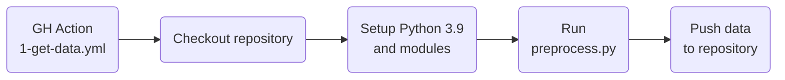
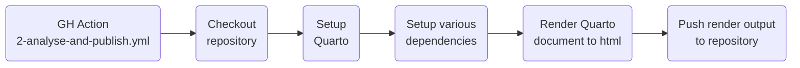
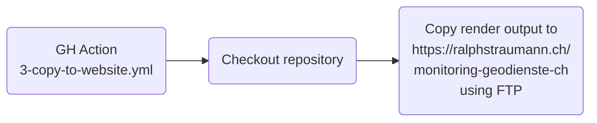

# geodienste.ch Monitoring

## Introduction

On [geodienste.ch](https://geodienste.ch), the cantons and the Principality of Liechtenstein make their geodata available to the public. The geodata are available as far as possible throughout Switzerland, in a structurally harmonized and aggregated form. They can be obtained from geodienste.ch in various ways and used for one's own purposes in accordance with the respective terms and conditions.

This repository underpins a [website which shows how the Swiss cantons provide spatial data on the platform geodienste.ch](https://ralphstraumann.ch/monitoring-geodienste-ch). The website compares the cantons' offerings in terms of the number of available datasets and in terms of how openly the cantons make their data available (e.g. what are the terms and conditions for using the data?, is a contract required to use the data?, etc.).

## Presentation
In September 2023, I have presented this monitoring solution to KGK-CGC (the operating organisation behind geodienste.ch) and cantonal representatives. The presentation goes into some details also in technical regards. Slides (in German and French):

## Technologies

This repository obtains data from the application programming interface (API) of geodienste.ch which is based on [Swagger](https://swagger.io) and the [OpenAPI Specification 3](https://swagger.io/specification). The analysis is carried out using [Python 3.9](https://www.python.org/downloads/release/python-390) with [pandas](https://pandas.pydata.org) as well as using [R](https://www.r-project.org), various R packages and [Quarto](https://quarto.org). The data and analysis are updated weekly on early Monday mornings. The whole process is orchestrated using GitHub Actions.

## Workflows

This repository runs three GitHub Actions:
- *1 Data collection (geodienste.ch)* (specified in [`1-get-data.yml`](https://github.com/rastrau/geodienste-ch/blob/main/.github/workflows/1-get-data.yml))
- *2 Analysis and rendering (geodienste.ch)* (specified in [`2-analyse-and-publish.yml`](https://github.com/rastrau/geodienste-ch/blob/main/.github/workflows/2-analyse-and-publish.yml))
- *3 Publication (geodienste.ch)* (specified in [`3-copy-to-website.yml`](https://github.com/rastrau/geodienste-ch/blob/main/.github/workflows/3-copy-to-website.yml))

The GitHub Actions trigger the following workflows:

### Data collection

### Analysis and rendering

### Publication

## Transparency

All code to produce the analysis is openly available: The collection of data and preprocessing is done using [`preprocess.py`](https://github.com/rastrau/geodienste-ch/blob/main/preprocess.py) (with Python). The actual analysis is done using [`analyse.R`](https://github.com/rastrau/geodienste-ch/blob/main/analyse.R) with configurations in [`config.R` ](https://github.com/rastrau/geodienste-ch/blob/main/config.R). For production of the report, `config.R` and `analyse.R` are called from [`index.qmd`](https://github.com/rastrau/geodienste-ch/blob/main/index.qmd) (with R and Quarto).

If you find any errors in the code or in the interpretation of the results, please [open a new issue](https://github.com/rastrau/geodienste-ch/issues/new).
